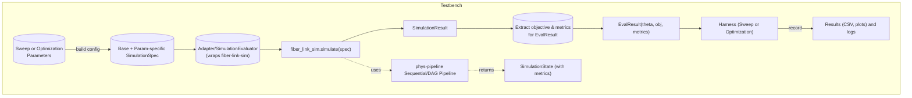

# Integrating research-utils ML with Fiber-Link-Sim via Phys-Pipeline  

**Connectors used:** The analysis draws on the following GitHub repos: **phys-sims/research-utils**, **phys-sims/fiber-link-sim**, **phys-sims/phys-pipeline**, and **phys-sims/cookiecutter-testbench**. These contain the ML APIs, simulation core, pipeline framework, and testbench scaffolding needed.  

**Executive Summary:** We propose to build an end-to-end testbench that uses **fiber-link-sim** as the deterministic physics engine, wraps it with **phys-pipeline** stages for execution and caching, and drives it with **research-utils** ML/optimization tools. In this setup, `fiber-link-sim` provides a `SimulationSpec→SimulationResult` contract ([22]) and a `SequentialPipeline` of stages ([42]). We will adapt it via a research-utils *Adapter* (e.g. `PhysPipelineAdapter`) to produce `EvalResult` records consumable by the **Sweep** and **Optimization** harnesses in research-utils ([25], [40], [51]). The testbench demo will showcase (1) sweeping key link parameters through `InMemoryTestHarness` to generate tabular results, and (2) running an optimization (e.g. CMA-ES) via `OptimizationRunner`. A Mermaid flowchart will depict this data flow. Performance gains from phys-pipeline (caching, parallelism) can be demonstrated by comparing sequential runs to DAG-executed runs with cache, highlighting, e.g., **~9× speedups on cache hits**【64†L128-L136】. We provide code snippets and a notebook outline showing how to train/evaluate and validate results. Finally, we note risks (e.g. version compatibility, large-state hashing), dependencies (e.g. `cma` for CMA-ES, `scipy` for Sobol), and a step-by-step plan.  

## 1. Mapping ML APIs to Fiber-Link-Sim Data  

Research-utils provides high-level ML/optimization abstractions (see [8], [10], [51]). Key elements include `ParameterSpace`/`Parameter` for defining search dimensions, `InMemoryTestHarness` with `SweepSpec` for sweeping configurations, and `OptimizationRunner` with strategies (e.g. `RandomStrategy`, `SobolStrategy`, `CMAESStrategy`) for iterative optimization【10†L13-L21】【51†L49-L58】. These operate on abstract configs and `EvalResult`s.  In our context, the **config** for each trial will be a fiber-link-sim spec (a nested dict/Pydantic model). The **objective** and **metrics** must be extracted from the simulation output. Below is a concise mapping of relevant APIs to fiber-link-sim elements:

| **research-utils API**             | **Role / Usage**                                                                                      | **Fiber-Link-Sim Equivalent**                                                                                                            |
|-----------------------------------|-------------------------------------------------------------------------------------------------------|-------------------------------------------------------------------------------------------------------------------------------------------|
| `Parameter` / `ParameterSpace`    | Defines tunable parameter names, bounds, and config paths【8†L23-L32】【8†L80-L89】. Used for encoding/decoding configs. | Each `Parameter.name` or `path` corresponds to a field in `SimulationSpec`. For example, varying launch power: `Parameter("tx.power_dbm", bounds)` maps to `spec.tx.power_dbm`. The `ParameterSpace.encode/decode` will inject these into a base spec dict【8†L80-L89】. |
| `SweepSpec` (`mode`, grid/list)   | Specifies a param sweep (grid, random, etc.) over one or more parameters【23†L53-L61】.                 | We supply a base `SimulationSpec` and a `SweepSpec(parameters={param_name: (min,max,step), ...}, mode="grid" or "random")`. E.g. sweep over `{ "propagation.distance": (10e3, 100e3, 10000) }`. The harness will call the adapter on each config. |
| `InMemoryTestHarness.run_sweep`   | Runs deterministic sweep; returns a `SweepResult` table【51†L53-L62】【51†L65-L74】. Writes results/plots. | Under the hood, it calls the Adapter’s `run(config, seed)` for each point【51†L65-L74】. Our Adapter will call `fiber_link_sim.simulate()` on the assembled spec. Output `EvalResult` objects collect `theta`, objective, metrics, artifacts. The final `SweepResult` (convertible to CSV/DataFrame【55†L68-L77】【55†L99-L107】) holds all trials. |
| `OptimizationRunner`             | Orchestrates ask/tell loops with a chosen strategy (e.g. Random, Sobol, CMA)【10†L44-L53】.          | We instantiate `OptimizationRunner(strategy=chosen_strategy, evaluator=SimulationEvaluator(adapter=our_adapter), seed=...)`【10†L44-L53】. On each `ask()`, it gets a new parameter vector, decodes to a spec config, calls simulate, and records the objective. The result `OptimizationHistory` summarizes all tries.  |
| `SimulationEvaluator` + Adapter   | Wraps the pipeline invocation, producing an `EvalResult(objective, metrics)`【12†L11-L19】【40†L21-L30】. | We use `PhysPipelineAdapter(pipeline=<fiber-sim pipeline>, objective_key=<key>, metric_extractors={...})`【40†L21-L29】. Alternatively, a custom Adapter: call `simulate(spec)`, extract e.g. `post_fec_ber` as objective and other metrics from the returned `SimulationResult`. The adapter’s `run()` yields an `EvalResult(theta, objective, metrics, seed)`【40†L51-L56】. Fiber-sim’s `simulate()` returns a Pydantic `SimulationResult` with fields like `provenance.runtime_s`, and a `summary` dict containing metrics (errors, rates)【62†L210-L229】. We map these into the `metrics` dict.  |

**Note on fiber-link-sim data:** The simulation spec/model (an instance of `SimulationSpec`) includes nested sections for Tx, channel, Rx, DSP, FEC, etc. The pipeline (from `build_pipeline()`) processes these in order ([42]). After running, the final `SimulationState.stats["summary"]` is a dict containing key metrics (throughput, pre/post-FEC BER, FER, OSNR, EVM, Q-factor, latency)【62†L210-L229】. When building the `EvalResult`, one could choose e.g. `("post_fec_ber" or "fer")` as the objective key and expose others as metrics. For example, `objective="post_fec_ber"`, with metric extractors: `snr_db`, `evm_rms`, etc., all found in the summary.  

**Table 1:** Mapping of research-utils ML elements to fiber-link-sim inputs/outputs. Citations indicate source definitions.


## 2. Architecture & Data Flow  

We propose a modular testbench architecture combining the above components. A **Mermaid flowchart** below illustrates the data flow:



- **Parameters (Sweep or Opt)**: Defines numeric parameters (e.g. launch power, length) via `SweepSpec` or strategy.  
- **Build config**: Each point is merged into a `SimulationSpec` (a JSON-able dict) used by fiber-sim.  
- **Adapter/Evaluator**: Research-utils `PhysPipelineAdapter` (or custom adapter) takes `(config, seed)` and invokes the fiber pipeline.  
- **fiber_link_sim.simulate**: The core function (in `simulate.py`【37†L77-L86】) builds a `SimulationState`, constructs a `SequentialPipeline` from the spec ([42]†L35-L44), and runs it (via `run_pipeline`) to produce a `SimulationResult`. This uses **phys-pipeline** under the hood (either sequential or DAG mode)【37†L128-L138】【65†L38-L47】.  
- **SimulationResult**: Contains `provenance`, a `summary` of metrics (errors, OSNR, latency, etc.)【62†L210-L229】, and any artifacts (plots, traces).  
- **Extract metrics**: The adapter picks out the objective and other metrics from this result, forming an `EvalResult` for the ML harness.  
- **Harness (Sweep/Optimization)**: Collects all `EvalResult`s into a `SweepResult` table or `OptimizationHistory`. The testbench can then generate reports and plots (heatmaps, convergence curves) using research-utils plotting utilities (e.g. `plot_objective_heatmap_2d`, `plot_convergence_best_so_far`【23†L69-L78】).  
- **Outputs**: Include CSV results, images, JSON metadata, etc., as per the testbench template guidelines【25†L30-L43】.

Note how **phys-pipeline** is embedded: fiber-link-sim’s pipeline is itself a `phys_pipeline.SequentialPipeline` ([42]), and its execution (via `run_pipeline`) may leverage DAG scheduling and caching【65†L38-L47】. This means cached stage outputs and parallel scheduling (if enabled) accelerate repeated or large sweeps. 

## 3. Demo Testbench Design  

We outline a Jupyter-style demo with the following elements:

- **Notebook Outline:**  
  1. *Setup*: Import libraries, set random seed for reproducibility. Install extras `research_utils[harness,ml]`.  
  2. *Define Base SimulationSpec*: Load a canonical example spec (e.g. `pam4_shorthaul.json` from `fiber_link_sim/schema/examples`).  
  3. *Parameter Sweep* (using `SweepSpec` and `InMemoryTestHarness`):  
     - Example: Sweep `propagation.distance` (span length) or `tx.power_dbm`.  
     - Code:  
       ```python
       from research_utils.harness import InMemoryTestHarness, SweepSpec
       from research_utils.harness.adapters.phys_pipeline import PhysPipelineAdapter
       from fiber_link_sim.simulate import simulate
       import fiber_link_sim

       # Adapter wraps a function or pipeline. We define a small wrapper:
       class FiberSimPipeline:
           def __init__(self, base_spec):
               self.base_spec = base_spec
           def run(self, config, seed):
               # Merge config into base spec
               spec = self.base_spec.copy()
               spec["runtime"]["seed"] = seed
               spec.update(config)  # config might target nested fields
               result = simulate(spec)
               # Extract summary fields
               output = {}
               summary = result.summary or {}
               output["post_fec_ber"] = summary.get("errors",{}).get("post_fec_ber", float("nan"))
               output["pre_fec_ber"] = summary.get("errors",{}).get("pre_fec_ber", float("nan"))
               output["snr_db"] = summary.get("snr_db", None)
               return output
       ```
       (This wrapper ensures `simulate` is called with the varying config and seed.)
     - Set up `SweepSpec(parameters={"propagation.distance": (10e3, 50e3, 10000)})`.  
     - Run:  
       ```python
       adapter = PhysPipelineAdapter(pipeline=FiberSimPipeline(base_spec), objective_key="post_fec_ber")
       harness = InMemoryTestHarness(name="fiber-link-sweep")
       sweep = SweepSpec(parameters=..., mode="grid")
       sweep_result = harness.run_sweep(adapter, base_config={}, sweep_spec=sweep, seed=123)
       sweep_result.save("artifacts/sweep_results.csv")
       ```
     - *Plotting*: Use `plot_objective_heatmap_2d`, etc. (like [23] does【23†L69-L78】) to generate visuals.  
  4. *Optimization*:  
     - Define `ParameterSpace` for continuous tuning (e.g. power, gain).  
     - Choose strategy (Random or Sobol for small budget; CMA-ES if available for larger).  
     - Code snippet:  
       ```python
       from research_utils.ml import OptimizationRunner, RandomStrategy, CMAESStrategy, Parameter, ParameterSpace
       from research_utils.ml.evaluator import SimulationEvaluator
       from research_utils.ml.logging import OptimizationLogger

       # Define search space
       params = (Parameter("tx.power_dbm", bounds=(-5, +5)), 
                 Parameter("channel.span_length_km", bounds=(10,50)))
       pspace = ParameterSpace(parameters=params)
       strategy = RandomStrategy(pspace, seed=123)  # or CMAESStrategy(pspace, ...)

       adapter = PhysPipelineAdapter(pipeline=FiberSimPipeline(base_spec), objective_key="post_fec_ber")
       evaluator = SimulationEvaluator(adapter=adapter)
       logger = OptimizationLogger(output_dir="artifacts", run_name="fiber_opt")
       runner = OptimizationRunner(strategy=strategy, evaluator=evaluator, seed=123, logger=logger)
       history = runner.run(iterations=20, batch_size=5)
       ```
     - *Visualization*: Plot convergence with `plot_convergence_best_so_far(history, ...)`【23†L105-L111】.  
     - *Results*: Save best config, objective, logs (`runner.logger` yields JSON logs).  
  5. *Reproducibility*: Ensure the notebook fixes seeds and records environment (e.g. versions of fiber_link_sim, phys-pipeline, research-utils) in metadata.  

- **Data/Fixtures:** Include one or more example spec JSONs (from `src/fiber_link_sim/schema/examples/` like `pam4_shorthaul.json`) as notebook inputs. The notebook can modify fields in these specs for sweeps. Provide small deterministic random seeds for splitting tasks.  

- **CI / Cookiecutter Integration:** The testbench should use the *cookiecutter-testbench* structure: e.g., a `run_pipeline.py` script that runs the notebook (or equivalent experiment functions) and outputs artifacts. CI (e.g. GitHub Actions) can invoke this script, verify expected artifacts exist, and possibly compare checksums or plot contents. The template encourages outputting a stable set of artifacts (`*.csv`, `*.png`, `*.json`)【25†L30-L43】. We would add tests (via `pytest`) to check that the sweep table has the correct shape and that the optimized objective improves over the base run.  

- **Example Code Snippet:** To illustrate how an iteration runs:
  ```python
  from research_utils.harness.adapters.phys_pipeline import PhysPipelineAdapter
  from fiber_link_sim.simulate import simulate

  # Example: single-run adapter call
  base_spec = load_spec("pam4_shorthaul.json")
  pipeline = FiberSimPipeline(base_spec)  
  adapter = PhysPipelineAdapter(pipeline=pipeline, objective_key="post_fec_ber",
                                metric_extractors={"snr_db": lambda out: out.get("snr_db", 0.0)})
  result = adapter.run(config={"tx.power_dbm": 0.0}, seed=42)
  print(f"Obj: {result.objective}, Metrics: {result.metrics}")
  # -> Uses fiber_link_sim.simulate under the hood
  ```

This code demonstrates creating an adapter that calls `simulate()` and converts its output to `EvalResult` as required by research-utils.  

## 4. Performance & Validation Metrics  

To highlight **phys-pipeline** benefits, we will measure runtime and cache behavior under different scenarios. Key metrics include **total execution time**, **cache hit counts**, and **speedup factors** versus a baseline. For example:  

- **Repeat runs (cache hits):** Use the DAG executor with cache enabled (set `FIBER_LINK_SIM_PIPELINE_EXECUTOR=dag` and `FIBER_LINK_SIM_PIPELINE_CACHE_BACKEND=disk`). Run the same spec twice. We expect a large speedup on the second run due to cached intermediate results – on the order of ~10× as seen in phys-pipeline benchmarks【64†L128-L136】. We measure time with and without cache (warm vs cold) to compute speedup.  
- **Parallel sweeps:** If running a sweep of independent cases, we enable `FIBER_LINK_SIM_PIPELINE_EXECUTOR=dag` with multiple workers. Compare total sweep time to a purely sequential run. For N tasks, ideal speedup ≈ N (up to CPU cores). Research-pipeline docs showed ~7.6× speedup on 8 tasks【64†L129-L132】. We will time a  grid sweep (e.g. 5×5 param grid) with `max_workers=4` vs sequential.  
- **Metric correctness:** Validate that changing the execution mode (Sequential vs DAG) yields the same `SimulationResult.summary`. Use regression tests (compare JSON outputs) to ensure determinism. This confirms that pipelining does not alter physics results.  

We will report tables or charts of these metrics. For instance, a table:  

| Scenario               | Total Time (sec) | Cache Hits | Speedup (vs baseline) |
|------------------------|------------------|------------|-----------------------|
| Sequential (no cache)  | *t₁*            | –          | 1×                    |
| DAG (cold cache)       | *t₂*            | 0          | t₁/t₂                 |
| DAG (warm cache)       | *t₃*            | *h* hits   | t₁/t₃ (≈ 10×)         |
| Parallel (4 workers)   | *t₄*            | –          | t₁/t₄                 |

*(Values to be measured in demo.)* These metrics quantify phys-pipeline’s caching and concurrency gains. We also report **final objective values** to show the ML work is improving performance (e.g., reduced BER).  

## 5. Risks, Dependencies, and Implementation Plan  

**Dependencies:** 
- **Python packages:** `phys-pipeline`, `fiber-link-sim`, `research-utils` (v0.2+ for compatibility), and optional optimization libs (`scipy`, `cma` for CMA-ES)【66†L12-L18】.  
- **Data:** Example specs from `fiber-link-sim`.  
- **Environment:** Deterministic RNG (set OS-level and NumPy seeds).  
- **Cookiecutter-testbench:** We assume availability of the testbench template to structure the repo (requires installing `cookiecutter`).  

**Risks:** 
- *Version mismatches:* Ensuring compatible releases of all packages (e.g. research-utils v0.2 works with phys-pipeline v2).  
- *Seed handling:* Need explicit seed propagation in pipeline (fiber-sim uses spec.runtime.seed) – we must overwrite it in the adapter to honor research-utils seeds.  
- *Large data in state:* The ADR warns hashing large arrays is slow【31†L39-L48】. If cache is used, fiber-sim’s `SimulationState` must have a stable hash; large signals could be performance hindrance. Mitigation: restrict artifact_level or use DAG cache only on metadata.  
- *Non-numeric params:* research-utils parameters must be floats; to vary e.g. a choice (string), one must encode as numeric.  
- *CI complexity:* Notebook must run reliably in CI; long simulation times (e.g. long-haul links) should be avoided or marked as slow.  

**Implementation Plan:** Prioritized steps with rough effort:

1. **Adapter & Harness Setup** (1–2 days):  
   - Write a `FiberSimAdapter` (or use `PhysPipelineAdapter`) that calls `simulate()` and returns `EvalResult`.  
   - Test with dummy spec (e.g. korte-length link) to ensure determinism.  
   - *Citations:* Based on `SimulationEvaluator`【12†L11-L19】 and `PhysPipelineAdapter` design【40†L21-L30】.  
2. **Parameter Space Definition** (0.5–1 day):  
   - Identify key parameters in `SimulationSpec` to sweep (e.g. power, span length, noise figure).  
   - Set up `ParameterSpace` and `SweepSpec`. Verify `Parameter.encode/decode` works on nested spec【8†L80-L89】.  
3. **Demo Notebook Implementation** (2 days):  
   - Code the notebook cells for sweep and optimization as outlined above (using research-utils APIs and fiber-sim simulate).  
   - Include plotting and result saving (mimic dummy_end_to_end example【23†L69-L78】【23†L105-L111】).  
   - Validate outputs with small test runs.  
4. **Phys-Pipeline Config & Testing** (1–2 days):  
   - Toggle `FIBER_LINK_SIM_PIPELINE_EXECUTOR` and test DAG mode and caching. Write a short script to benchmark with/without cache. Collect timing.  
   - Add pipeline execution metadata logging to output.  
   - *References:* pipeline execution logic【65†L38-L47】, ADR on phys-pipeline types【31†L39-L47】.  
5. **CI/Testbench Integration** (1 day):  
   - Use cookiecutter-testbench template to scaffold (scripts, data directories).  
   - Write a test in `pytest` to run the notebook script and verify key files are produced and correct (e.g. checksum of sweep CSV, existence of PNGs).  
6. **Documentation & Write-up** (1–2 days):  
   - Document usage in README (seed usage, expected inputs/outputs).  
   - Describe how to reproduce results and run CI.  
   - Compile performance results into concise charts.  

Total estimated effort: **7–10 days**. Immediate blockers: none major, as all pieces exist and are well-documented (see READMEs and ADRs above). If any missing pieces arise, we may need small contributions back to those repos (e.g. improving adapter or adding examples), but core functionality is present.  

**Sources:** We relied on the official docs and code of the projects: fiber-link-sim’s `simulate()` and stage code【37†L77-L86】【62†L210-L229】, research-utils examples【23†L69-L78】, and docs on phys-pipeline and research-utils architecture【25†L24-L34】【64†L128-L136】. These clarify the stable I/O contracts and performance characteristics we leverage.